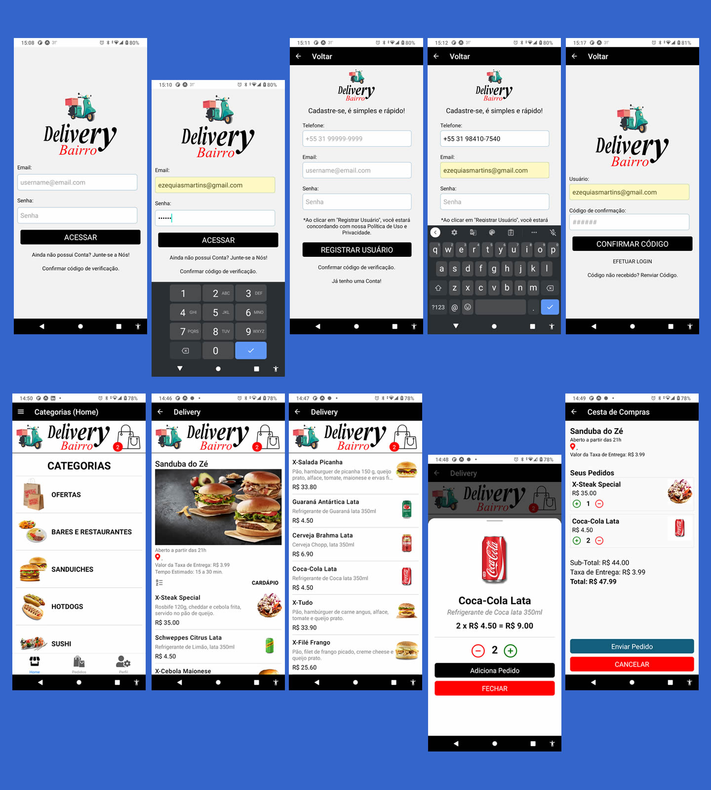

## DeliveryBairro App 
Projeto desenvolvido em React Native + Expo CLI para gestão de pedidos e entregas foco no segmento de Delivery em Geral, tais como Bares, Restaurantes, Fastfoods, Distribuidoras de Bebidas, Farmárcias, Drograrias, Mercados de Conveniência, Supermercados, Gás de Cozinha, Água Mineral, etc.

## instalação
On Prompt Command (CMD): `c:\psi-software`:

1. `yarn global add @aws-amplify/cli@latest`
2. `npm install -g expo-cli`
3. `npm install -g eas-cli`
4. `npx create-expo-app UserApp (--blank) `
5. `add @aws-amplify/ui-react-native aws-amplify react-native-safe-area-context amazon-cognito-identity-js @react-native-community/netinfo @react-native-async-storage/async-storage react-native-get-random-values react-native-url-polyfill`
6. `amplify update api` (Atualizar API AWS Amplify)
7. `amplify pull --appId d1920iq732or85 --envName staging` (sincronizar e atualizar modelos e dados c/ backend)

## Edit & Run App

1. `cd UserApp && code .`
2. `npx expo start`

## Atualizando o NodeJs/npm, Expo-CLI e EAS-CLI
`https://www.npmjs.com/package/npm-windows-upgrade`

`npm install -g expo-cli`
`npm install -g eas-cli`

## deployment

<i>Obs.: Remover aws-export.js em .gitignore e atualizar o repositório (new commit)</i>

`eas build -p android --profile preview`

## Contato

telefone: (31) 98410-7540 WhatsApp

email: ezequiasmartins@gmail.com

by <a href="https://ezequiasmartins.blogspot.com/" target="_blank">Ezequias Martins</a> ® 1999-2023 Direitos Reservados

